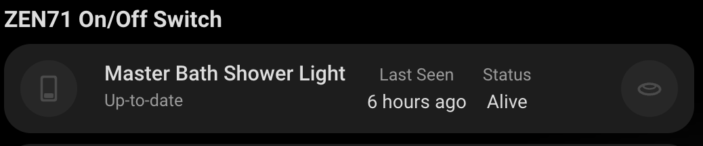
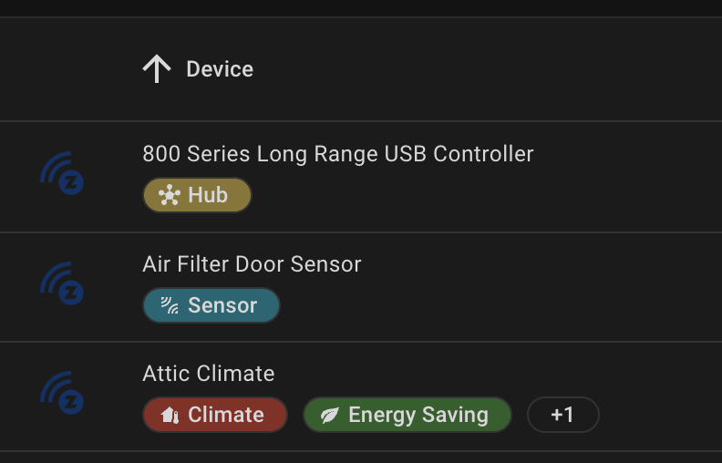

<p align="center">
    
</p>
<p align="center"><h1 align="center">Z-Wave Card Set</h1></p>
<p align="center">
	<em>Boosting your Z-Wave integration.</em>
</p>


[](https://github.com/hacs/integration)


<p align="center">Built with the tools and technologies:</p>
<p align="center">
	
	
	
	
	
</p>
<br>

## Overview

This project brings a set of cards to display info about your Z-Wave devices. Many of these are great if you have a dedicated status view for your network or connected devices.

## Cards

### [Device Center](src/cards/device-center/README.md)

See all your devices and their states and some controls if applicable in one place.


### [Z-Wave Nodes Status Card](src/cards/node-states/README.md)

Shows status and last seen time of all your nodes.


### [Hub Card](src/cards/hub-card/README.md)

Shows info about the Z-Wave Hub.


### Info Cards

# Update for Info Cards section

#### [ZEN04 800LR - Smart Plug](docs/smart-plug.md)

Commonly used for controlling appliances and devices.


#### [ZEN16 - Multi Relay](docs/multi-relay.md)

Commonly used for controlling multiple independent circuits.


#### [ZEN30 - Double Switch](docs/double-switch.md)

Commonly used for light/fan switches.


#### [ZEN32 - Scene Controller](docs/scene-controller.md)

Commonly used for scene and automation control.


#### [ZEN51 - Dry Contact Relay](docs/dry-contact-relay.md)

Commonly used for garage doors and other contact-based controls.


#### [ZEN52 - Double Relay](docs/double-relay.md)

Commonly used for light/fan in wall.


#### [ZEN55 LR - DC Signal Sensor](docs/dc-signal-sensor.md)

Commonly used for smoke sensor detection


#### [ZEN71 - On/Off Switch](docs/on-off-switch.md)

Commonly used for basic lighting control.



More to come...

## Installation

### HACS (Recommended)

1. Open HACS in your Home Assistant instance
2. Click the menu icon in the top right and select "Custom repositories"
3. Add this repository URL and select "Dashboard" as the category
   - `https://github.com/homeassistant-extras/zwave-card-set`
4. Click "Install"

### Manual Installation

1. Download the `zwave-card-set.js` file from the latest release in the Releases tab.
2. Copy it to your `www/community/zwave-card-set/` folder
3. Add the following to your `configuration.yaml` (or add as a resource in dashboards menu)

```yaml
lovelace:
  resources:
    - url: /local/community/zwave-card-set/zwave-card-set.js
      type: module
```

Add the cards to your dashboard using the UI editor or YAML.

## Configuration Options

See the README files of the individual cards for configuration and detailed information.

- [Device Center](src/cards/device-center/README.md)
- [Z-Wave Nodes Status Card](src/cards/node-states/README.md)
- [Z-Wave Hub Card](src/cards/hub-card/README.md)
- Info Cards
  - [ZEN04 800LR - Smart Plug](docs/smart-plug.md)
  - [ZEN16 - Multi Relay](docs/multi-relay.md)
  - [ZEN30 - Double Switch](docs/double-switch.md)
  - [ZEN32 - Scene Controller](docs/scene-controller.md)
  - [ZEN51 - Dry Contact Relay](docs/dry-contact-relay.md)
  - [ZEN52 - Double Relay](docs/double-relay.md)
  - [ZEN55 LR - DC Signal Sensor](docs/dc-signal-sensor.md)
  - [ZEN71 - On/Off Switch](docs/on-off-switch.md)

Some cards may require the hub to be labeled with a "Hub" label:



## Supported Devices

These are tested, others may work.

### Hubs

- ZST39 LR

### Switches

- ZEN30
- ZEN32
- ZEN71

### Plugs

- ZEN04 800LR

### Relays

- ZEN16
- ZEN51
- ZEN52

### Sensors

- ZEN55 LR

## Project Roadmap

- [x] **`Initial design`**: <strike>create initial room card based on button-card template in UI minimialist theme.</strike>
- [x] **`Editors`**: <strike>make sure stub configs and previews are solid.</strike>
- [ ] **`Node cards`**: show info about different nodes.
- [ ] **`Node status card sizing`**: make sizing dynamic, can't figure it out.
- [ ] **`Themes`**: test default theme, etc.
- [ ] **`Device Center`**: add docs and pics towards end.
- [ ] **`Sensors on info card`**: like plugs and stuff.

## Contributing

- **💬 [Join the Discussions](https://github.com/homeassistant-extras/zwave-card-set/discussions)**: Share your insights, provide feedback, or ask questions.
- **🐛 [Report Issues](https://github.com/homeassistant-extras/zwave-card-set/issues)**: Submit bugs found or log feature requests for the `zwave-card-set` project.
- **💡 [Submit Pull Requests](https://github.com/homeassistant-extras/zwave-card-set/blob/main/CONTRIBUTING.md)**: Review open PRs, and submit your own PRs.
- **📣 [Check out discord](https://discord.gg/F28wupKC)**: Need further help, have ideas, want to chat?

<details closed>
<summary>Contributing Guidelines</summary>

1. **Fork the Repository**: Start by forking the project repository to your github account.
2. **Clone Locally**: Clone the forked repository to your local machine using a git client.
   ```sh
   git clone https://github.com/homeassistant-extras/zwave-card-set
   ```
3. **Create a New Branch**: Always work on a new branch, giving it a descriptive name.
   ```sh
   git checkout -b new-feature-x
   ```
4. **Make Your Changes**: Develop and test your changes locally.
5. **Commit Your Changes**: Commit with a clear message describing your updates.
   ```sh
   git commit -m 'Implemented new feature x.'
   ```
6. **Push to github**: Push the changes to your forked repository.
   ```sh
   git push origin new-feature-x
   ```
7. **Submit a Pull Request**: Create a PR against the original project repository. Clearly describe the changes and their motivations.
8. **Review**: Once your PR is reviewed and approved, it will be merged into the main branch. Congratulations on your contribution!
</details>

## License

This project is protected under the MIT License. For more details, refer to the [LICENSE](LICENSE) file.

## Acknowledgments

- Built using [LitElement](https://lit.dev/)
- Inspired by Home Assistant's chip design
- Button-Card was a huge inspo
- Thanks to all contributors!

[](https://github.com{/homeassistant-extras/zwave-card-set/}graphs/contributors)

[](https://ko-fi.com/N4N71AQZQG)

## Build Status

### Main

[](https://github.com/homeassistant-extras/zwave-card-set/actions/workflows/push.yml)
[](https://github.com/homeassistant-extras/zwave-card-set/actions/workflows/pull_request.yaml)

### Release

[](https://github.com/homeassistant-extras/zwave-card-set/actions/workflows/push.yml)
[](https://github.com/homeassistant-extras/zwave-card-set/actions/workflows/merge.yaml)
