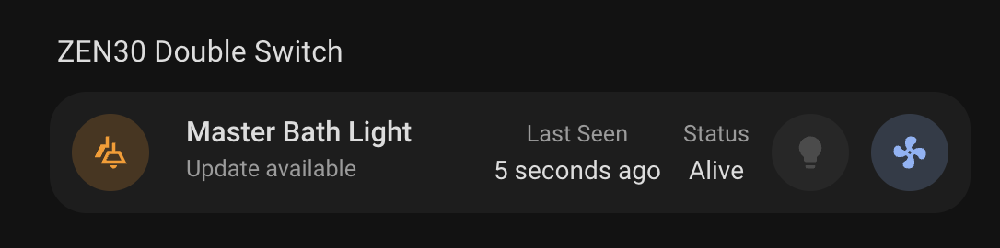

# Double Switch Card

A custom card for Home Assistant that displays and controls your ZEN30 Double Switch device with a clean interface. This card provides an at-a-glance view of both switch states, device status, and allows for easy control of connected lights and switches.



## Features

- Controls two independent switches
- Supports both lights and regular switches
- Displays ZEN30 Double Switch status with visual indicators
- Shows firmware information
- Displays last seen timestamp
- Monitors state of both switches
- Responsive design that works on both desktop and mobile
- Easy configuration through the Home Assistant UI

## Configuration

| Name      | Type   | Default                              | Description                        |
| --------- | ------ | ------------------------------------ | ---------------------------------- |
| device_id | string | _Required_                           | The device ID of your ZEN30 switch |
| title     | string | "Double Switch"                      | Custom title for the card          |
| icon      | string | "mdi:ceiling-light-multiple-outline" | Custom icon for the switch         |

## Usage

1. Install the card in your Home Assistant instance
2. Add the card to your dashboard through the UI
3. Configure the card with your device ID
   - if using YAML, this is the device id, not an entity id.
   - device must be a Z-Wave ZEN30 model

Example configuration in YAML:

```yaml
type: custom:zwave-double-switch
device_id: your_device_id_here
title: Living Room Switches
```

```yaml
type: custom:zwave-double-switch
device_id: your_device_id_here
```

## Status Indicators

The card displays several important status indicators:

- **Firmware Information**: Current firmware version
- **Last Seen**: When the device last communicated with your system
- **Node Status**: Current operational status of the device
- **Switch 1 Status**: Current state of the first switch
- **Switch 2 Status**: Current state of the second switch

## Interactive Elements

All elements on the card support:

- Tap action: Toggles the state of the switch
- Hold action: Opens more information about the specific switch
- Double-tap action: Opens more information about the specific switch

## Requirements

- Home Assistant
- At least one ZEN30 Double Switch device
- Z-Wave integration configured in Home Assistant
- Compatible with both light and switch entity domains

## Support

For issues and feature requests, please visit the [GitHub repository](https://github.com/homeassistant-extras/zwave-card-set).
