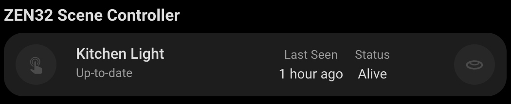

# Scene Controller Card

A custom card for Home Assistant that displays and controls your ZEN32 Scene Controller device with a clean interface. This card provides an at-a-glance view of your scene controller's status, button states, and allows for easy management of connected scenes and automations.



## Features

- Controls and monitors multiple scene buttons
- Displays ZEN32 Scene Controller status with visual indicators
- Shows firmware information
- Displays last seen timestamp
- Monitors button states and LED indicators
- Responsive design that works on both desktop and mobile
- Easy configuration through the Home Assistant UI

## Configuration

| Name      | Type   | Default                  | Description                            |
| --------- | ------ | ------------------------ | -------------------------------------- |
| device_id | string | _Required_               | The device ID of your ZEN32 controller |
| title     | string | "Scene Controller"       | Custom title for the card              |
| icon      | string | "mdi:gesture-tap-button" | Custom icon for the controller         |

## Usage

1. Install the card in your Home Assistant instance
2. Add the card to your dashboard through the UI
3. Configure the card with your device ID
   - if using YAML, this is the device id, not an entity id.

Example configuration in YAML:

```yaml
type: custom:zooz-scene-controller
device_id: your_device_id_here
title: Living Room Scene Controller
```

```yaml
type: custom:zooz-scene-controller
device_id: your_device_id_here
```

## Status Indicators

The card displays several important status indicators:

- **Firmware Information**: Current firmware version
- **Last Seen**: When the device last communicated with your system
- **Node Status**: Current operational status of the device
- **Button States**: Current state of each scene button
- **LED Status**: Current status of button LED indicators
- **Scene Information**: Active scene status and last triggered information

## Interactive Elements

All elements on the card support:

- Tap action: Activates the associated scene or function
- Hold action: Opens scene configuration options
- Double-tap action: Opens more information about the controller

## Requirements

- Home Assistant
- At least one ZEN32 Scene Controller device
- Z-Wave integration configured in Home Assistant

## Support

For issues and feature requests, please visit the [GitHub repository](https://github.com/homeassistant-extras/zooz-card-set).
