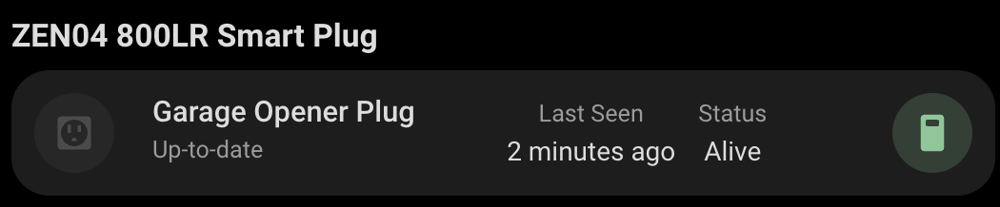

# Smart Plug Card

A custom card for Home Assistant that displays and controls your ZEN04 800LR Smart Plug device with a clean interface. This card provides an at-a-glance view of your smart plug's state, device status, and allows for easy control of connected appliances.



## Features

- Controls smart plug on/off state
- Displays ZEN04 800LR Smart Plug status with visual indicators
- Shows firmware information
- Displays last seen timestamp
- Monitors power state
- Responsive design that works on both desktop and mobile
- Easy configuration through the Home Assistant UI

## Configuration

| Name      | Type   | Default               | Description                      |
| --------- | ------ | --------------------- | -------------------------------- |
| device_id | string | _Required_            | The device ID of your ZEN04 plug |
| title     | string | "Smart Plug"          | Custom title for the card        |
| icon      | string | "mdi:power-socket-us" | Custom icon for the plug         |

## Usage

1. Install the card in your Home Assistant instance
2. Add the card to your dashboard through the UI
3. Configure the card with your device ID
   - if using YAML, this is the device id, not an entity id.

Example configuration in YAML:

```yaml
type: custom:zwave-smart-plug
device_id: your_device_id_here
title: Living Room Smart Plug
```

```yaml
type: custom:zwave-smart-plug
device_id: your_device_id_here
```

## Status Indicators

The card displays several important status indicators:

- **Firmware Information**: Current firmware version
- **Last Seen**: When the device last communicated with your system
- **Node Status**: Current operational status of the device
- **Power State**: Current on/off state of the plug

## Interactive Elements

All elements on the card support:

- Tap action: Toggles the state of the plug
- Hold action: Opens more information about the plug
- Double-tap action: Opens more information about the plug

## Requirements

- Home Assistant
- At least one ZEN04 800LR Smart Plug device
- Z-Wave integration configured in Home Assistant

## Support

For issues and feature requests, please visit the [GitHub repository](https://github.com/homeassistant-extras/zwave-card-set).
