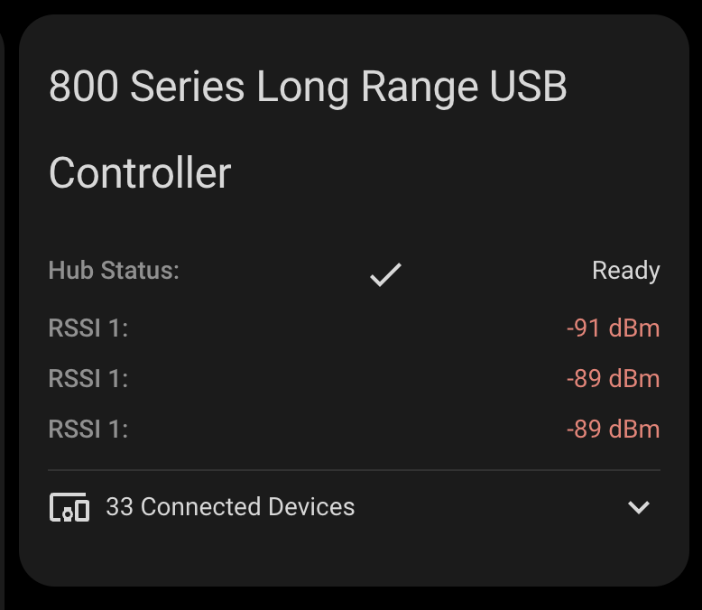

# Z-Wave Hub Card

A custom card for Home Assistant that displays the status of your Z-Wave hub and connected devices. This card provides a clean interface to monitor your hub's status, signal strength, and allows you to quickly view all connected Z-Wave devices.



## Features

- Displays the Z-Wave hub status with visual indicators
- Shows RSSI signal strength with color-coded values
- Lists all connected Z-Wave devices with expandable/collapsible view
- Direct links to device configuration pages
- Responsive design that works on both desktop and mobile
- Easy configuration through the Home Assistant UI

## Configuration

No configuration for this debice

## Usage

1. Install the card in your Home Assistant instance
2. Add the card to your dashboard through the UI
3. Configure the card settings if needed

Example configuration in YAML:

```yaml
type: custom:zwave-controller
```

## Status Indicators

- Hub Status: Shows the current operational status of your Z-Wave hub
- RSSI Indicators:
  - 🟢 Green: Good signal strength (better than -60 dBm)
  - 🟡 Amber: Fair signal strength (between -60 and -80 dBm)
  - 🔴 Red: Poor signal strength (worse than -80 dBm)

## Connected Devices

The card allows you to:

- See the total count of connected Z-Wave devices
- Expand/collapse the device list
- Click on any device to go directly to its configuration page

## Requirements

- Home Assistant
- At least one Z-Wave hub
- Z-Wave integration configured in Home Assistant

## Support

For issues and feature requests, please visit the [GitHub repository](https://github.com/homeassistant-extras/zwave-card-set).
