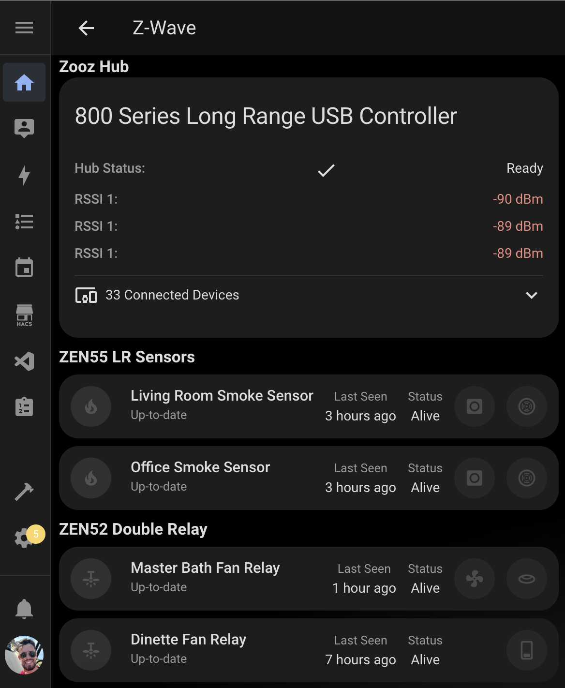

# Z-Wave Device Center Card

A custom card for Home Assistant that provides a centralized view of all your Z-Wave devices, grouped by manufacturer and model. This card organizes your devices in a clean, organized layout while offering flexible display options.



## Features

- Groups devices by manufacturer and model
- Optional area filtering to show devices from specific areas
- Customizable display options
- Automatically organizes devices into logical sections
- Clean, organized layout for easy viewing
- Responsive design that works on both desktop and mobile
- Easy configuration through the Home Assistant UI

## Configuration

| Name     | Type   | Default | Description                                         |
| -------- | ------ | ------- | --------------------------------------------------- |
| area     | string | none    | Optional area ID to filter devices by specific area |
| features | array  | none    | Optional display customization features             |

### Feature Options

| Feature                      | Description                             |
| ---------------------------- | --------------------------------------- |
| `use_icons_instead_of_names` | Use icons instead of labels for sensors |
| `show_headers`               | Display manufacturer and model headers  |

## Usage

1. Install the card in your Home Assistant instance
2. Add the card to your dashboard through the UI
3. Optionally configure area filter and display features

Example configurations in YAML:

Basic usage:

```yaml
type: custom:zwave-device-center
```

With area filtering:

```yaml
type: custom:zwave-device-center
area: living_room
```

With display features:

```yaml
type: custom:zwave-device-center
features:
  - show_headers
  - use_icons_instead_of_names
```

## Display Options

### Area Filtering

Filter devices by a specific area in your home, making it easy to view devices in a particular room or zone.

### Headers

When the `show_headers` feature is enabled, the card displays:

- Manufacturer names as primary headers
- Model and device names as secondary headers

### Sensor Display

The `use_icons_instead_of_names` feature allows you to:

- Replace text labels with icons for sensors
- Create a more compact and visually appealing view

## Device Organization

The card automatically groups your devices by:

- Manufacturer
- Model
- Device name

Each device maintains its individual card functionality, allowing you to:

- View device status
- Check firmware information
- Monitor last seen timestamps
- Access device-specific controls

## Requirements

- Home Assistant
- At least one Z-Wave device
- Z-Wave integration configured in Home Assistant

## Support

For issues and feature requests, please visit the [GitHub repository](https://github.com/homeassistant-extras/zwave-card-set).
