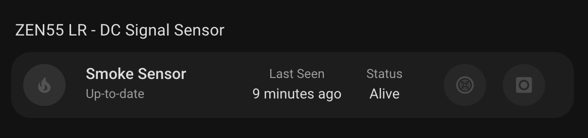

# DC Signal Sensor Card

A custom card for Home Assistant that displays the status of your ZEN55 DC Signal Sensor with a clean interface. This card provides an at-a-glance view of your smoke and carbon monoxide detector's status, firmware information, and last seen timestamp.



## Features

- Displays ZEN55 DC Signal Sensor status with visual indicators
- Shows firmware information
- Displays last seen timestamp
- Monitors both smoke and carbon monoxide detection status
- Responsive design that works on both desktop and mobile
- Easy configuration through the Home Assistant UI

## Configuration

| Name      | Type   | Default        | Description                        |
| --------- | ------ | -------------- | ---------------------------------- |
| device_id | string | _Required_     | The device ID of your ZEN55 sensor |
| title     | string | "Smoke Sensor" | Custom title for the card          |
| icon      | string | "mdi:fire"     | Custom icon for the sensor         |

## Usage

1. Install the card in your Home Assistant instance
2. Add the card to your dashboard through the UI
3. Configure the card with your device ID
   - if using YAML, this is the device id, not an entity id.

Example configuration in YAML:

```yaml
type: custom:dc-signal-sensor
device_id: your_device_id_here
title: Living Room Smoke Detector
```

## Status Indicators

The card displays several important status indicators:

- **Firmware Information**: Current firmware version
- **Last Seen**: When the device last communicated with your system
- **Node Status**: Current operational status of the sensor
- **Smoke Detection**: Visual indicator for smoke detection status
- **Carbon Monoxide Detection**: Visual indicator for CO detection status

## Interactive Elements

All elements on the card support:

- Tap action: Opens more information about the specific sensor
- Hold action: Opens more information about the specific sensor
- Double-tap action: Opens more information about the specific sensor

## Requirements

- Home Assistant
- At least one ZEN55 DC Signal Sensor
- Z-Wave integration configured in Home Assistant

## Support

For issues and feature requests, please visit the [GitHub repository](https://github.com/homeassistant-extras/zooz-card-set).
