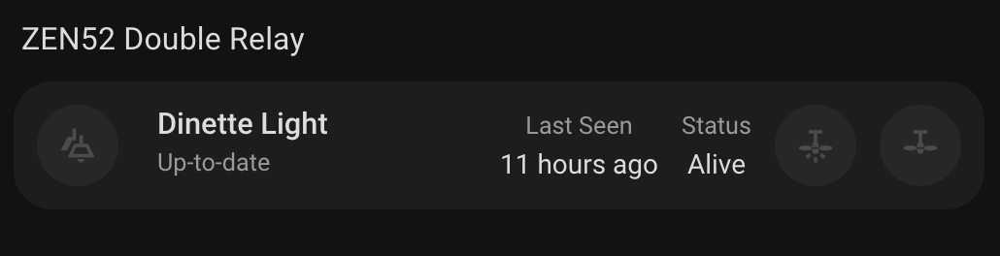

# Double Relay Card

A custom card for Home Assistant that displays and controls your ZEN52 Double Relay device with a clean interface. This card provides an at-a-glance view of both relay states, device status, and allows for easy control of connected devices.



## Features

- Controls two independent relay switches
- Displays ZEN52 Double Relay status with visual indicators
- Shows firmware information
- Displays last seen timestamp
- Monitors state of both relays
- Responsive design that works on both desktop and mobile
- Easy configuration through the Home Assistant UI

## Configuration

| Name      | Type   | Default                 | Description                       |
| --------- | ------ | ----------------------- | --------------------------------- |
| device_id | string | _Required_              | The device ID of your ZEN52 relay |
| title     | string | "Double Relay"          | Custom title for the card         |
| icon      | string | "mdi:ceiling-fan-light" | Custom icon for the relay         |

## Usage

1. Install the card in your Home Assistant instance
2. Add the card to your dashboard through the UI
3. Configure the card with your device ID
   - if using YAML, this is the device id, not an entity id.

Example configuration in YAML:

```yaml
type: custom:zooz-double-relay
device_id: your_device_id_here
title: Living Room Fan & Light
```

```yaml
type: custom:zooz-double-relay
device_id: your_device_id_here
```

## Status Indicators

The card displays several important status indicators:

- **Firmware Information**: Current firmware version
- **Last Seen**: When the device last communicated with your system
- **Node Status**: Current operational status of the device
- **Relay 1 Status**: Current state of the first relay
- **Relay 2 Status**: Current state of the second relay

## Interactive Elements

All elements on the card support:

- Tap action: Toggles the state of the relay
- Hold action: Opens more information about the specific relay
- Double-tap action: Opens more information about the specific relay

## Requirements

- Home Assistant
- At least one ZEN52 Double Relay device
- Z-Wave integration configured in Home Assistant

## Support

For issues and feature requests, please visit the [GitHub repository](https://github.com/homeassistant-extras/zooz-card-set).
