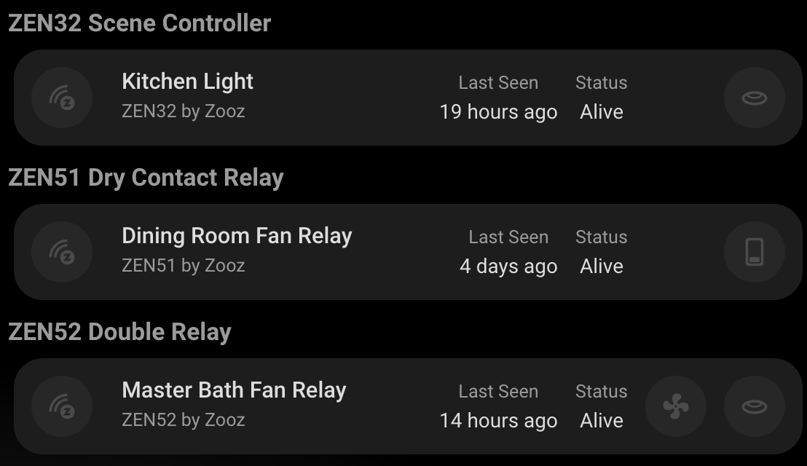
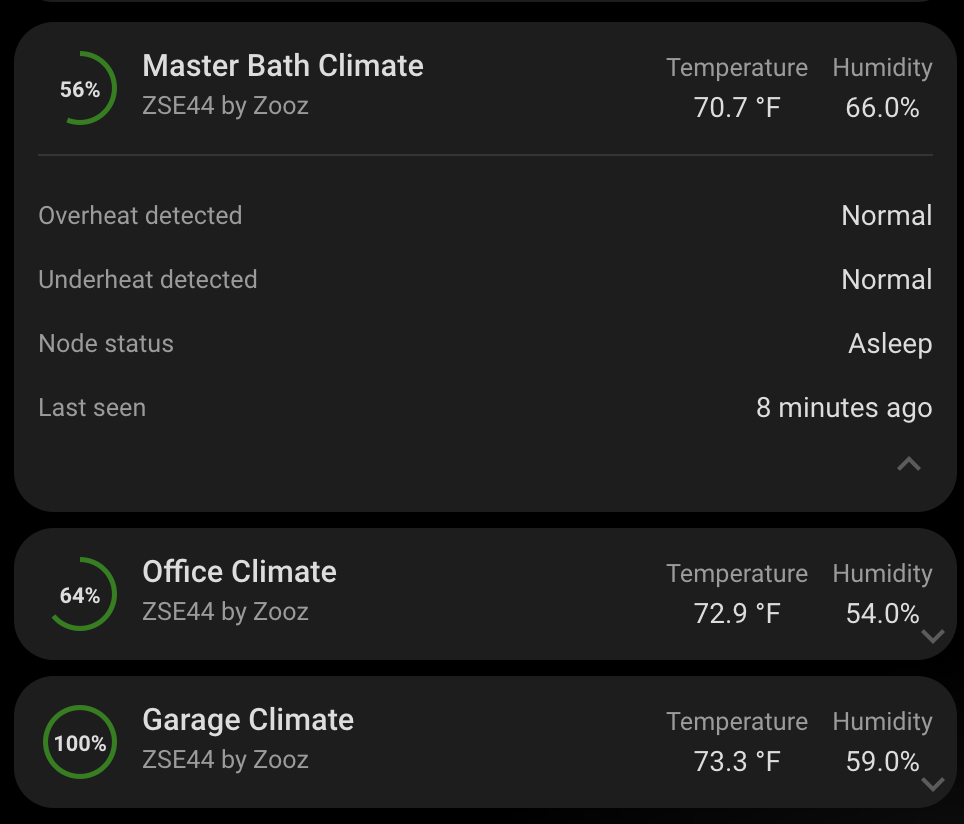
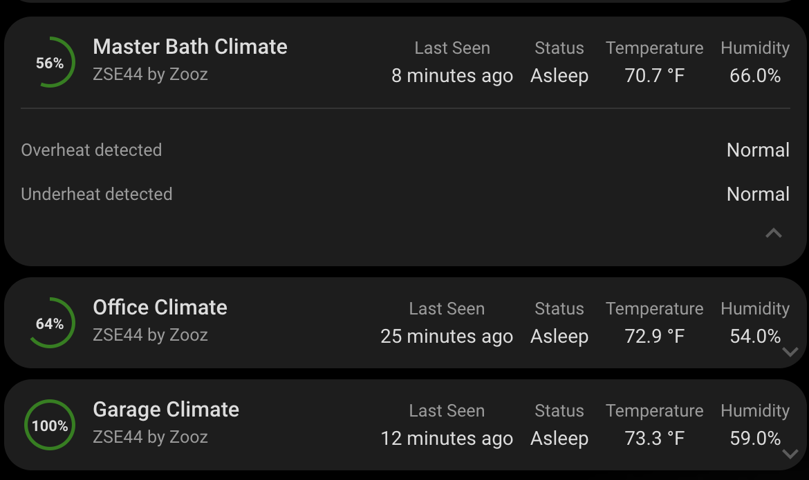

# Z-Wave Device Info Card

A custom card for Home Assistant that displays detailed information about individual Z-Wave devices. This card provides an at-a-glance view of your device's status, firmware information, and entity controls, all in a clean unified interface.



## Features

- Universal card for all Z-Wave device types
- Displays device firmware information and status
- Shows battery level indicator for battery-powered devices
- Shows last seen timestamp and node status
- Integrated controls for all device entities
- Expandable sensor section for detailed sensor data
- Automatic handling of hub devices (displays hub card)
- Fully responsive design that adapts to different card sizes
- Easy configuration through the Home Assistant UI

## Configuration

| Name      | Type   | Default     | Description                                        |
| --------- | ------ | ----------- | -------------------------------------------------- |
| device_id | string | _Required_  | The device ID of your Z-Wave device                |
| title     | string | Device name | Custom title for the card                          |
| icon      | string | mdi:z-wave  | Custom icon for the device                         |
| features  | list   | None        | Optional features to enable (see Features Options) |

### Feature Options

| Name                       | Type | Description                                                 |
| -------------------------- | ---- | ----------------------------------------------------------- |
| use_icons_instead_of_names | flag | Display icons instead of sensor names in the sensor section |

## Usage

1. Install the card in your Home Assistant instance
2. Add the card to your dashboard through the UI
3. Configure the card with your device ID
   - if using YAML, this is the device id, not an entity id.

Example configuration in YAML:

```yaml
type: custom:zwave-device
device_id: your_device_id_here
```

With custom title and icon:

```yaml
type: custom:zwave-device
device_id: your_device_id_here
title: Living Room Motion Sensor
icon: mdi:motion-sensor
```

With feature options:

```yaml
type: custom:zwave-device
device_id: your_device_id_here
features:
  - use_icons_instead_of_names
```

## Responsive Design

The card automatically adapts to different sizes:

- On larger cards: All information is displayed in the main view
- On smaller cards: Status and last seen information moves to the expandable sensor section
- Entity controls remain accessible regardless of card size



## Expandable Sensor Section

The card now includes an expandable section for sensor data:

- Click the chevron icon to expand/collapse the sensor section
- View detailed sensor information including measurements, events, and diagnostics
- Configure how sensors are displayed using the feature options



## Status Indicators

The card displays several important status indicators:

- **Firmware Information**: Current firmware version
- **Last Seen**: When the device last communicated with your system
- **Node Status**: Current operational status of the device (online/offline/etc.)
- **Battery Level**: Battery percentage for battery-powered devices
- **Entity Controls**: Interactive elements for controlling device entities
- **Sensor Data**: Measurements, events, and diagnostic data from the device

## Interactive Elements

All elements on the card support:

- Tap action: Toggles states for switches/lights or opens more info for sensors
- Hold action: Opens more information dialog
- Double-tap action: Opens more information dialog

## Hub Device Detection

The card automatically detects if a device is a Z-Wave controller/hub. If a hub device is detected, it will display the Z-Wave Hub Card instead, providing the appropriate hub-specific information.

## Requirements

- Home Assistant
- At least one Z-Wave device
- Z-Wave JS integration configured in Home Assistant

## Support

For issues and feature requests, please visit the [GitHub repository](https://github.com/homeassistant-extras/zwave-card-set).
