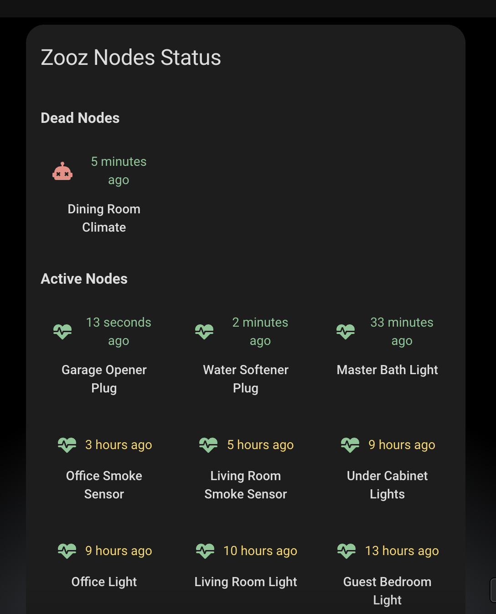
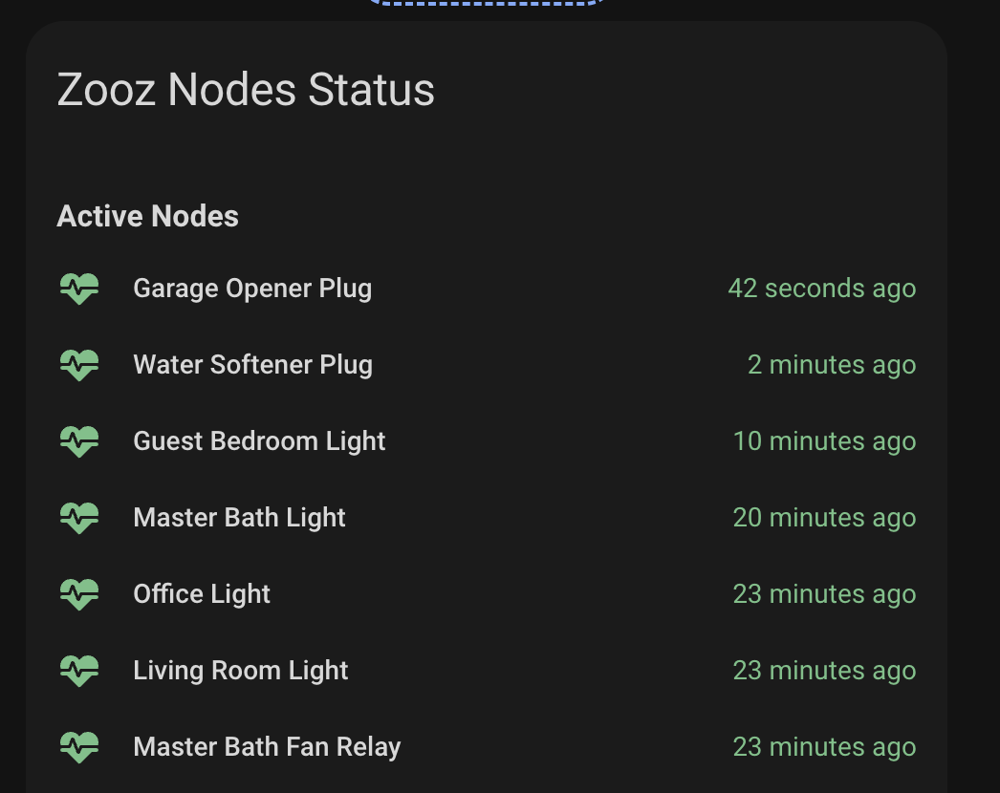

# Z-Wave Nodes Status Card

A custom card for Home Assistant that displays the status of all your Z-Wave devices in an organized grid layout. The card categorizes devices into three groups: Active, Sleeping, and Dead nodes, making it easy to monitor your Z-Wave network's health.



## Features

- Groups Z-Wave devices by their current status (Active, Sleeping, Dead)
- Displays last seen timestamp for each device
- Color-coded status indicators for quick visual reference
- Customizable grid layout (1-3 columns)
- Node layout alignment options (centered or left-aligned)
- Support for layout options and custom actions
- Responsive design that works on both desktop and mobile
- Easy configuration through the Home Assistant UI

## Configuration

| Name              | Type   | Default               | Description                                 |
| ----------------- | ------ | --------------------- | ------------------------------------------- |
| title             | string | "Z-Wave Nodes Status" | Card title                                  |
| columns           | number | 3                     | Number of columns in the grid (1-3)         |
| layout            | string | none                  | Node layout: `centered` or `left-aligned`   |
| tap_action        | object | none                  | Action to perform when card is tapped       |
| hold_action       | object | none                  | Action to perform when card is held         |
| double_tap_action | object | none                  | Action to perform on double tap             |
| features          | list   | See below             | Optional flags to toggle different features |

### Feature Options

| Name    | Type | Description                |
| ------- | ---- | -------------------------- |
| compact | flag | Make the view more compact |

Compact Card:


## Usage

1. Install the card in your Home Assistant instance
2. Add the card to your dashboard through the UI
3. Configure the card settings if needed (title, columns, and layout)

Example configuration in YAML:

```yaml
type: custom:zwave-nodes-status
```

```yaml
type: custom:zwave-nodes-status
title: My Z-Wave Devices
columns: 2
layout: centered
```

## Layout Options

The card supports different layout configurations:

```yaml
type: custom:zwave-nodes-status
layout: centered
# or
layout: left-aligned
```

## Actions

The card supports various tap actions to interact with Z-Wave devices. Here are some examples:

### Ping a Z-Wave Device

To enable ping functionality for Z-Wave devices:

- **NOTE** - don't set any targets

```yaml
type: custom:zwave-nodes-status
tap_action:
  action: perform-action
  perform_action: zwave_js.ping
```

### Other Action Examples

```yaml
type: custom:zwave-nodes-status
tap_action:
  action: call-service
  service: zwave_js.heal_network
double_tap_action:
  action: perform-action
  perform_action: zwave_js.ping
```

```yaml
type: custom:zwave-nodes-status
tap_action:
  action: navigate
  navigation_path: /config/devices
hold_action:
  action: more-info
```

## Status Indicators

- 🟢 Green: Device is active and recently seen
- 🟡 Amber: Device is sleeping or hasn't been seen in 2-24 hours
- 🔴 Red: Device is dead or hasn't been seen in over 24 hours

## Requirements

- Home Assistant
- At least one Z-Wave device
- Z-Wave integration configured in Home Assistant

## Support

For issues and feature requests, please visit the [GitHub repository](https://github.com/homeassistant-extras/zwave-card-set).
